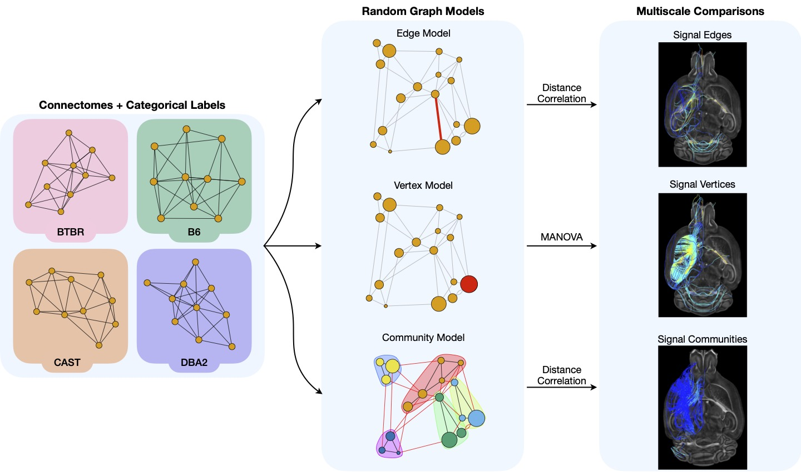
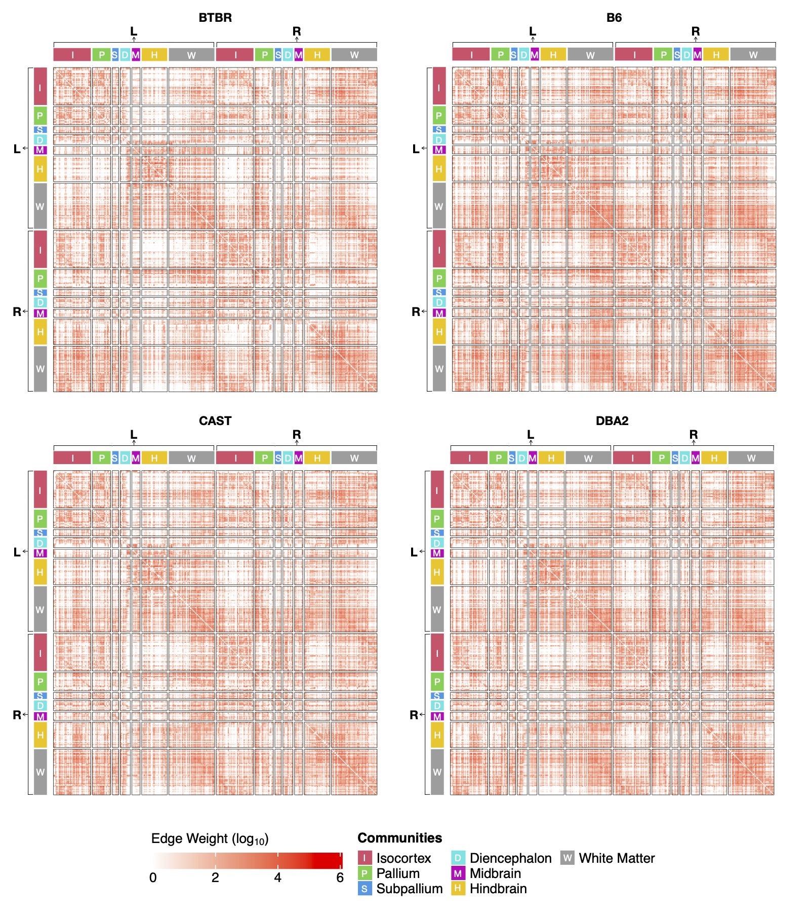
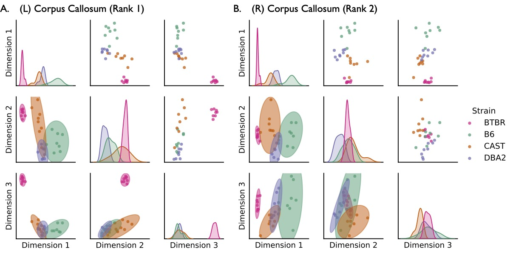
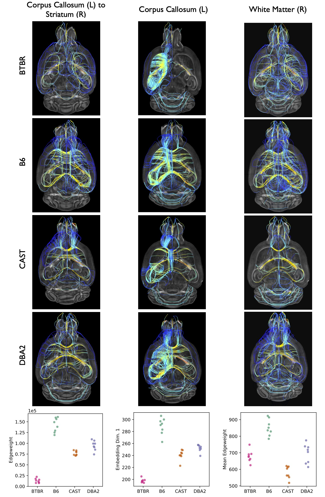
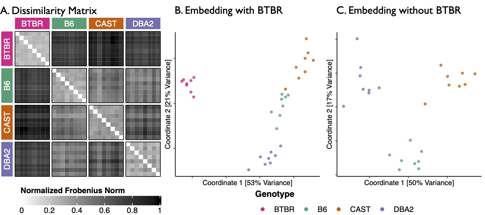
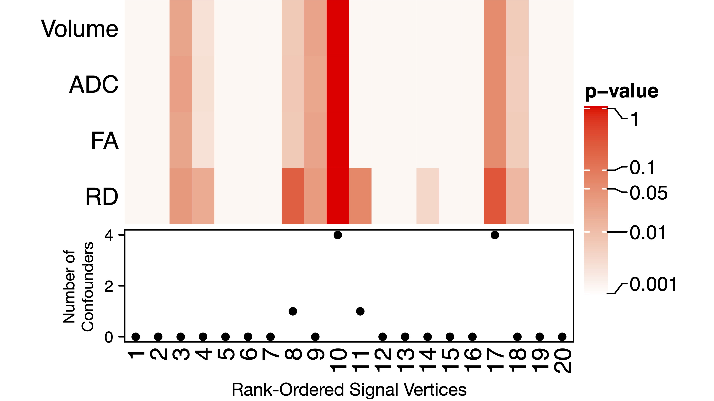

# Multiscale Comparative Connectomics

[](https://arxiv.org/abs/2011.14990)
[](https://codeocean.com/capsule/2210516/tree)
[](https://opensource.org/licenses/MIT)

Reproducible code for the results shown in our manuscript [*Multiscale Comparative Connectomics*](https://arxiv.org/abs/2011.14990) (`MCC`).

> Vivek Gopalakrishnan, Jaewon Chung, Eric Bridgeford, Benjamin D. Pedigo, Jesús Arroyo, Lucy Upchurch, G. Allan Johnson, Nian Wang, Youngser Park, Carey E. Priebe, and Joshua T. Vogelstein. “Multiscale Comparative Connectomics”. arXiv:2011.14990 (Nov. 2020).

## Table of Figures and Tables

Click any link for individual instructions on how to generate that specific figure.
Alternatively, execute the file `code/run` to generate all figures at once.

#### [Figure 1: _Overview of the statistical framework for multiscale comparative connectomics._](#figure-1)

#### [Figure 2: _Average connectomes for each mouse strain with hierarchical structure labels._](#figure-2)

#### [Figure 3: _Vertex embeddings of the corpus callosum obtained by the omnibus embedding._](#figure-3)

#### [Figure 4: _Tractograms of the strongest signal edge, vertex, and community._](#figure-4)

#### [Figure 5: _Whole-brain embeddings of all mouse connectomes in a low-dimensional space._](#figure-5)

#### [Figure 6: _Our methods uncover more information about network topology than neuroanatomical metrics._](#figure-6)

## System Requirements

`MCC` uses both Python 3.8 and R 3.6.1.
The analyses above depend on the following packages:
```
# Conda Python packages
jupyter==1.0.0
rpy2==3.3.6
statsmodels==0.12.1

# Pip install the latest version of graspologic
graspologic @ git+git://github.com/microsoft/graspologic@dev

# Conda R packages
r-base==3.6.1
bioconductor-complexheatmap==2.2.0
r-cairo==1.5_10
r-circlize==0.4.12
r-data.table==1.12.2
r-essentials==3.6.0
r-future==1.21.0
r-future.apply==1.7.0
r-ggplot2==3.1.1
r-globaloptions==0.1.2
r-igraph==1.2.4.1
r-mltools==0.3.5
r-tidyverse==1.2.1

# CRAN R packages
cdcsis==2.0.3
```

These analyses have been tested on macOS x64 and Linux x64.

### Installation Instructions
We created a computational environment with these packages using a dedicated [Miniconda](https://docs.conda.io/en/latest/miniconda.html) kernel:
```
conda env create --file environment.yml --name mcc
```
It takes about 5 min to install all packages. 

## Reproducing Figures

Scripts to reproduce the figures in `MCC` are organized below.

#### Figure 1
- Run `code/1_statistical_framework_graphs.ipynb` (expected runtime: 5 seconds)
- This script uses `igraph` to generate the sample connectomes and graph models seen above



#### Figure 2
- Run `code/2_plot_adjacency_matrices.ipynb` (expected runtime: 5 seconds)
- This script uses `ComplexHeatmap` to generate average connectomes for each mouse strain


#### Figure 3
- Run `code/3_cc_emedding.ipynb` (expected runtime: 5 seconds)
- This script uses `graspologic` to embed the corpus callosum brain region of every mouse in a low-dimensional space


#### Figure 4
- Run `code/4a_identifying_signal_components.ipynb` (expected runtime: 2 min)
- This script uses `graspologic` and various *k*-sample hypothesis testing packages to identify the strongest signal edges, vertices, and communities


#### Tables 1-4
- Run `code/4b_format_signal_components_tables.ipynb` (expected runtime: 30 seconds)
- This script uses `pandas` to nicely format the results generated for Figure 4 into publication-ready tables
- Tables are found in the Supplement of the `MCC` manuscript

#### Figure 5
- Run `code/5_whole_brain_emedding.ipynb` (expected runtime: 5 seconds)
- This script uses classical multidimensional scaling (cMDS) to embed the results of the omnibus embedding in a low-dimensional space


#### Figure 6
- Run `code/6_conditional_independence_anatomy.ipynb` (expected runtime: 5 hours on a 48 core CPU, around 40 hours on a normal desktop computer)
- This script uses `cdcsis` to compute a bunch of conditional independence tests
- The purpose of this test is to determine if our methods recover information about network topology not encoded in neuroanatomy

